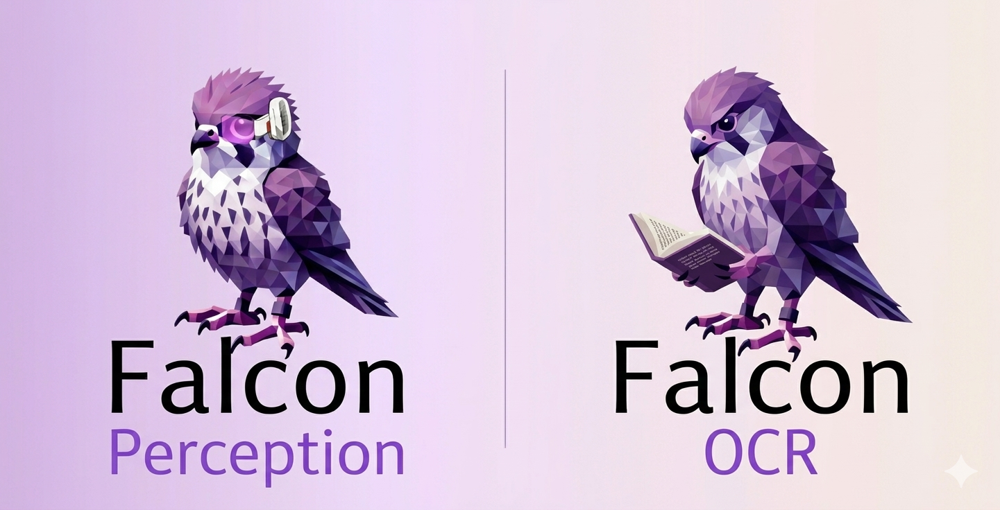

<p align="center">
  
</p>

<p align="center">
  <a href="http://arxiv.org/abs/2603.27365"></a>&nbsp;&nbsp;
  <a href="https://huggingface.co/blog/tiiuae/falcon-perception"></a>&nbsp;&nbsp;
  <a href="https://vision.falcon.aidrc.tii.ae"></a>
</p>
<p align="center">
  <a href="https://huggingface.co/datasets/tiiuae/PBench"></a>&nbsp;&nbsp;
  <a href="https://huggingface.co/tiiuae/Falcon-OCR"></a>&nbsp;&nbsp;
  <a href="https://huggingface.co/tiiuae/Falcon-Perception"></a>
</p>

# Falcon Perception
A minimal, readable yet performant PyTorch inference engine implementation of **Falcon Perception** — a natively multimodal, dense, autoregressive Transformer model that performs **object detection**, **instance segmentation**, or **OCR** from natural language queries.


> *"Segment these expressions in the image: the cat on the left"* → bounding boxes + pixel-level masks

> *"Extract the text content from this image."* → text / latex formulas / html table ... 


## Contents
- [Quick Start](#quick-start)
  - [Installation](#installation)
  - [Run Perception (detection / segmentation)](#run-perception-detection--segmentation)
  - [Run OCR (text extraction)](#run-ocr-text-extraction)
  - [Run Multiple Samples with Paged Inference Engine](#run-multiple-samples-with-paged-inference-engine)
  - [Interactive Notebooks](#interactive-notebooks)
- [Inference Engines](#inference-engines)
  - [PyTorch Inference Engines](#pytorch-inference-engines)
    - [Paged Inference Engine](#paged-inference-engine)
    - [Paged OCR Inference Engine](#paged-ocr-inference-engine)
    - [Batch Inference Engine](#batch-inference-engine)
  - [MLX Batch Inference Engine (Apple Silicon)](#mlx-batch-inference-engine-apple-silicon)
- [Inference Server](#inference-server)
  - [Launch Server](#launch-server)
  - [Launch Streamlit Demo App](#launch-streamlit-demo-app)
- [vLLM Docker Server (FalconOCR Only)](#vllm-docker-server-falconocr-only)
  - [Serving Throughput](#serving-throughput)
  - [Quick Start](#quick-start-1)
- [Citation](#citation)
- [Acknowledgments](#acknowledgments)


## Quick Start

### Installation

The package supports two backends: **PyTorch** (CUDA GPUs) and **MLX** (Apple Silicon Macs).
A bare `pip install` auto-detects your platform, or you can pick an explicit extra.

| Install command | Backend | When to use |
|---|---|---|
| `pip install -e .` | Auto-detect | Mac -> MLX, Linux -> Torch |
| `pip install -e ".[torch]"` | PyTorch + CUDA | GPU server or explicit Torch on Mac |
| `pip install -e ".[mlx]"` | MLX | Apple Silicon Mac |
| `pip install -e ".[ocr]"` | Torch + transformers | Layout-aware OCR (needs a layout detection model) |
| `pip install -e ".[dev]"` | -- | Adds tensorboard, matplotlib, ipykernel |
| `pip install -e ".[server]"` | -- | Adds FastAPI / Uvicorn for the paged inference server |

```bash
# Example: from source with uv (recommended)
uv sync                       # installs torch with CUDA 12.8 wheels by default
source .venv/bin/activate
```

#### CUDA version

`uv sync` defaults to **CUDA 12.8** wheels for PyTorch (works with NVIDIA driver >= 570.x).
If you need a different CUDA version, edit the `[[tool.uv.index]]` URL in `pyproject.toml`:

```bash
# CUDA 12.6 (driver >= 560.x)
url = "https://download.pytorch.org/whl/cu126"
# CUDA 13.0 (driver >= 575.x) — or remove [tool.uv.sources] entirely
url = "https://download.pytorch.org/whl/cu130"
```

Then re-run `uv lock && uv sync`.

If installing with **pip** instead of uv, install PyTorch first with the correct CUDA version:

```bash
pip install torch torchvision --index-url https://download.pytorch.org/whl/cu128
pip install -e .
```

> **Note:** The MLX backend does not require PyTorch or transformers at all.
> The core data pipeline and tokenizer run on numpy/PIL and the lightweight
> [tokenizers](https://github.com/huggingface/tokenizers) library.

### Run Perception (detection / segmentation)

**PyTorch (GPU)**
```bash
# Auto-downloads model + streaming sample image from Huggingface
python demo/perception_single.py

# Custom image and query, can be path or url
python demo/perception_single.py --image photo.jpg --query "cat"

# Detection only (no masks)
python demo/perception_single.py --image photo.jpg --query "cat" --task detection
```

**MLX (Apple Silicon)**
```bash
python demo/perception_single_mlx.py --image photo.jpg --query "cat"

# Detection only
python demo/perception_single_mlx.py --image photo.jpg --query "cat" --task detection
```

### Run OCR (text extraction)

**PyTorch (GPU)**
```bash
# Auto-downloads model + stream sample image from HuggingFace
python demo/ocr_single.py

# Custom document image
python demo/ocr_single.py --image document.png

# Layout-aware OCR (detects regions first, then extracts text per region)
# Requires the [ocr] extra: pip install -e ".[ocr]"
# This will lazily download and run a 3rd party layout detection model
# PaddlePaddle/PP-DocLayoutV3_safetensors from Huggingface
python demo/ocr_single.py --image document.png --task ocr_layout
```

**MLX (Apple Silicon)**
```bash
python demo/ocr_single_mlx.py --image document.png
python demo/ocr_single_mlx.py  # loads a demo sample from OCRBench-v2
```

**OCR modes**

| Mode | Best for | How |
|------|----------|-----|
| **Plain OCR** | Simple documents, real-world photos, slides, receipts, invoices | `--task ocr_plain` |
| **Layout + OCR** | Complex multi-column documents, academic papers, reports, dense pages | `--task ocr_layout` |

### Run Multiple Samples with Paged Inference Engine

```bash
# Perception — PBench dataset
python demo/perception_benchmark.py  # stream 50 samples from HF
python demo/perception_benchmark.py --limit -1  # stream entire benchmark

# OCR — OCRBench-v2 dataset
python demo/ocr_benchmark.py
python demo/ocr_benchmark.py --limit 200
```

### Interactive Notebooks

Step-by-step walkthroughs with inline visualizations:

| Notebook | Description | Colab |
|---|---|---|
| [`demo/perception.ipynb`](demo/perception.ipynb) | **Falcon Perception** — engine setup, detection vs segmentation, HR cache, dense tuning, PBench level showcase, and benchmark with IoU metrics | [](https://colab.research.google.com/drive/1Jy6lRYuGMKJEt9--KBLm6kjbC-vQ0Uwe) |
| [`demo/ocr.ipynb`](demo/ocr.ipynb) | **Falcon OCR** — full-page and layout-based OCR across handwriting, formulas, tables, scanned documents, and scientific papers | [](https://colab.research.google.com/drive/1HYOcYWqmeUT9j2h6_dNM2lX1mlI34Bfa) |
| [`demo/perception_agent.ipynb`](demo/perception_agent.ipynb) | **Perception Agent** — grounded visual reasoning agent using Falcon Perception as a tool with an orchestrator VLM for multi-step scene understanding | [](https://colab.research.google.com/drive/1wg4EbNDKllAxoK1v5gbdRzkrKjdjIwbj) |
| [`demo/perception_ov_mot.ipynb`](demo/perception_ov_mot.ipynb) | **Open-Vocab Multi-Object Tracking** — video object tracking pipeline using Falcon Perception in detection and segmentation modes | [](https://colab.research.google.com/drive/13Hiei8As2JbiZuYllXQTNX_ZelysZSpH) |


## Inference Engines

### PyTorch Inference Engines

**We use FlexAttention for both inference engines and training.**
The hybrid attention mask (bidirectional image + causal text) is expressed as composable mask functions. 
The FlexAttention's `maskmod` also make it easy to implement continuous batching with paged attention via simple Python.
PyTorch's `flex_attention` compiles them into fused Triton kernel — no custom attention code needed.

#### Paged Inference Engine

Performant engine with CUDAGraph and continuous batching via a paged KV cache:

- **Paged KV cache** with virtual page tables (no wasted memory from padding)
- **Continuous batching**: new sequences enter mid-generation, finished ones release pages immediately
- **Torch compile**: piece-wise region outside the flex attention kernel.
- **CUDA graph capture** for the decode loop (eliminates kernel launch overhead, important for small models)
- **Background tokenization**: CPU thread pool overlapped with GPU compute
- **Preemption**: if memory is tight, running sequences can be paused and re-prefilled later
- **High-Resolution image feature cache** (for segmentation): LRU cache with pre-allocated pinned memory buffers for async GPU↔CPU transfer of high-resolution image features. Help reduce prefill time for subsequent query of the same image.

Please check `demo/perception_single.py` and `demo/perception_benchmark.py` on how to directly instantiate and use the engine.

> **NOTE**: First run will takes longer ~10-30s for torch compile and CUDAGraph capture. Subsequent run will be faster, around ~100ms for prefill, ~200ms for upsampling (0ms if cached), and ~50ms for decode a couple of instances (~10 tokens). (measured on H100)

#### Paged OCR Inference Engine

Extends the Perception's paged engine for document understanding:

- **Layout detection**: runs a lightweight detector to find text regions, tables, figures, headers
- **Per-region OCR**: crops each region and runs OCR inference with a category-specific prompt
- **Continuous batching and gather**: all crops of the image are sent to the engine for continuous batched extraction. Once all crops are completed, the output are gathered and assembed into a structured output.

Please check `demo/ocr_single.py` and `demo/ocr_benchmark.py` on how to directly instantiate and use the engine.

> **NOTE**: First `layout_ocr` run will lazily download and run the document layout detection model.

#### Batch Inference Engine

The simplest and closest to training code path, make it easier to understand the model's forward pass without all the optimization.
All sequences are left-padded to the same length (with correct rope indices and attention mask), runs a single prefill, then decodes token-by-token with a dense KV cache until all sequences are completed.

Please check the `demo/perception_single.py --engine-type batch` path for usage.


### MLX Batch Inference Engine (Apple Silicon)

The MLX backend provides batch inference on Apple Silicon Macs using the
[MLX](https://github.com/ml-explore/mlx) framework. It shares the same
model architecture and weights (auto-converted from safetensors on first load)
and produces equivalent results.

- Dense KV cache, left-padded batch inference
- `mx.fast.scaled_dot_product_attention` with native sink support
- Tiled windowed cross-attention in the AnyUp upsampler for memory efficiency
- No PyTorch or transformers dependency

See `demo/perception_single_mlx.py` for usage.

## Inference Server

The server provides a REST API to the continuous batching Paged Inference Engine across multiple GPUs.

### Launch server

```bash
# Install server and streamlit demo dependencies
uv sync --extra server --extra demo

# Auto-detects all available GPUs, compiles model, captures CUDA graphs
python -m falcon_perception.server

# Explicit config
python -m falcon_perception.server --config.num-gpus 2 --config.port 7680

# Or with the OCR model
python -m falcon_perception.server --config.hf-model-id tiiuae/Falcon-OCR --config.port 7681
```

The server starts one engine worker per GPU in a separate process (i.e. Data Parallel). Each worker builds its own model, runs `torch.compile`, and captures CUDA graphs for the decode loop. Workers communicate with the main FastAPI process via `multiprocessing.Queue` and the server will assign new request to the worker with lowest number of queuing requests.

Please check the [`server/README.md`](falcon_perception/server/README.md) for detailed usage.


### Launch Streamlit Demo App

A browser-based demo UI that connects to the inference server.

```bash
# With a server already launched in a separate terminal, launch the Streamlit app
streamlit run demo/streamlit_app.py
```

The app provides:
- Image upload and URL input
- Automatic model detection — the task selector shows only tasks supported by the loaded model (segmentation/detection for Falcon-Perception, OCR plain/layout for Falcon-OCR)
- Interactive mask and bounding box overlay visualization
- Adjustable image resolution settings
- Per-request timing breakdown


## vLLM Docker Server (FalconOCR Only)
For FalconOCR without the extra perception heads, we also provide a vLLM docker server for fast deployment.

### Serving Throughput

Measured on a single A100-80GB GPU with vLLM, processing document images from olmOCR-Bench at very high concurrency for optimal utilisation of vllm.

- **Layout + OCR** — The full end-to-end pipeline: layout detection finds regions on each page, crops them, and the VLLM runs on every crop. This is the real-world serving number that includes both layout and OCR time.

| Mode | tok/s | img/s | Description |
|------|------:|------:|-------------|
| **Layout + OCR** | 5,825 | 2.9 | Full pipeline: layout detection → crop → per-region OCR |

At 0.3B parameters, Falcon OCR is roughly 3x smaller than 0.9B-class OCR VLMs (e.g. PaddleOCR VL), which translates directly into higher serving throughput at competitive accuracy.

### Quick Start
For production OCR serving, we also provide a Docker image (~6,000 tok/s on a single A100) that bundles vLLM with an end-to-end parsing pipeline. It exposes two services: **vLLM** (port 8000, OpenAI-compatible API) and a **Pipeline** (port 5002, layout → crop → OCR → markdown).

```bash
# Two GPUs (best throughput): vLLM on one, layout model on the other
docker run -d --name falcon-ocr \
  --gpus '"device=0,1"' \
  -e EXPOSED_GPU_IDS=0,1 -e VLLM_GPU=0 -e PIPELINE_GPU=1 \
  -e VLLM_GPU_MEM_UTIL=0.90 \
  -p 8000:8000 -p 5002:5002 \
  ghcr.io/tiiuae/falcon-ocr:latest

# Single GPU (share memory — lower VLLM_GPU_MEM_UTIL to leave room for layout model)
docker run -d --name falcon-ocr \
  --gpus '"device=0"' \
  -e EXPOSED_GPU_IDS=0 -e VLLM_GPU=0 -e PIPELINE_GPU=0 \
  -e VLLM_GPU_MEM_UTIL=0.55 -e MAX_NUM_SEQS=512 \
  -p 8000:8000 -p 5002:5002 \
  ghcr.io/tiiuae/falcon-ocr:latest
```

```bash
# Upload (images or PDFs)
curl -X POST http://localhost:5002/falconocr/upload \
  -F "files=@document.pdf;type=application/pdf"

# Parse with layout detection
curl -X POST http://localhost:5002/falconocr/parse \
  -H "Content-Type: application/json" \
  -d '{"images": ["data:image/jpeg;base64,<...>"], "skip_layout": false}'

# Parse without layout (full image → VLM directly)
curl -X POST http://localhost:5002/falconocr/parse \
  -H "Content-Type: application/json" \
  -d '{"images": ["data:image/jpeg;base64,<...>"], "skip_layout": true}'
```

See the [Falcon-OCR model card](https://huggingface.co/tiiuae/Falcon-OCR) for the full API reference, configuration variables, and deployment options.

## Citation
If you use Falcon-Perception, please cite
```
@article{bevli2026falcon,
  title   = {Falcon Perception},
  author  = {Bevli, Aviraj and Chaybouti, Sofian and Dahou, Yasser and Hacid, Hakim and Huynh, Ngoc Dung and Le Khac, Phuc H. and Narayan, Sanath and Para, Wamiq Reyaz and Singh, Ankit},
  journal = {arXiv preprint arXiv:2603.27365},
  year    = {2026},
  url     = {https://arxiv.org/abs/2603.27365}
}
```
## Acknowledgments
We based on, built upon and are inspired by the following excellent work:
- https://github.com/pytorch/torchtitan
- https://github.com/karpathy/nanochat
- https://github.com/meta-pytorch/attention-gym
- https://github.com/changjonathanc/flex-nano-vllm
- https://github.com/vikhyat/moondream
- https://github.com/wimmerth/anyup
- https://github.com/roboflow/trackers
